# AI Trend Newsletter Service — Architecture

> 한국 개발자를 위한 AI 기술 트렌드 자동 수집·분석·발송 시스템
> 아키텍처 문서 | 최종 갱신: 2026-03-16

---

## 목차

1. [시스템 개요](#1-시스템-개요)
2. [서비스 구성 (컨테이너)](#2-서비스-구성-컨테이너)
3. [전체 데이터 흐름](#3-전체-데이터-흐름)
4. [일일 자동화 파이프라인](#4-일일-자동화-파이프라인)
5. [기사 수집 알고리즘](#5-기사-수집-알고리즘)
6. [중복 제거 알고리즘 (SimHash)](#6-중복-제거-알고리즘-simhash)
7. [기사 점수 산정 알고리즘](#7-기사-점수-산정-알고리즘)
8. [리포트 생성 파이프라인 (LLM)](#8-리포트-생성-파이프라인-llm)
9. [이메일 발송 파이프라인](#9-이메일-발송-파이프라인)
10. [데이터베이스 스키마 (ERD)](#10-데이터베이스-스키마-erd)
11. [API 엔드포인트 구조](#11-api-엔드포인트-구조)
12. [Frontend 페이지 구조](#12-frontend-페이지-구조)
13. [Celery 태스크 상태 전환](#13-celery-태스크-상태-전환)
14. [디렉토리 구조](#14-디렉토리-구조)

---

## 1. 시스템 개요

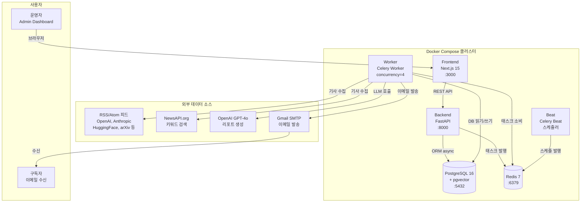

---

## 2. 서비스 구성 (컨테이너)

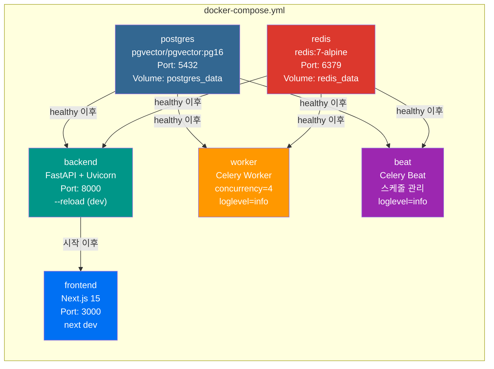

| 서비스 | 이미지 | 역할 | 의존성 |
|--------|--------|------|--------|
| `postgres` | pgvector/pgvector:pg16 | 주 데이터베이스 + 벡터 확장 | — |
| `redis` | redis:7-alpine | Celery 브로커 / 결과 백엔드 | — |
| `backend` | 로컬 빌드 | REST API 서버 + DB 마이그레이션 | postgres, redis |
| `worker` | 로컬 빌드 | 비동기 태스크 실행 (수집·생성·발송) | postgres, redis |
| `beat` | 로컬 빌드 | 일별 스케줄 발행 | postgres, redis |
| `frontend` | 로컬 빌드 | 관리자 대시보드 UI | backend |

**Redis DB 분리**

| DB 번호 | 용도 |
|---------|------|
| `redis:6379/0` | Celery 브로커 (태스크 큐) |
| `redis:6379/1` | Celery 결과 백엔드 |

---

## 3. 전체 데이터 흐름

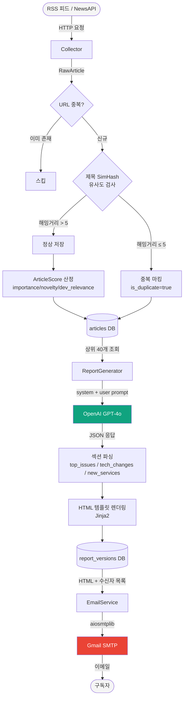

---

## 4. 일일 자동화 파이프라인

```mermaid
gantt
    title 일일 자동화 스케줄 (KST 기준)
    dateFormat HH:mm
    axisFormat %H:%M

    section 수집 (Collect)
    RSS/API 기사 수집       :collect, 07:00, 30m
    중복 제거 & 점수 산정   :score,   after collect, 15m

    section 생성 (Generate)
    상위 기사 선별          :select,  08:00, 10m
    GPT-4o 리포트 생성      :gpt,     after select, 20m
    HTML 렌더링 & DB 저장   :render,  after gpt, 10m

    section 발송 (Send)
    구독자 조회             :query,   09:00, 5m
    비동기 이메일 발송      :send,    after query, 20m
```

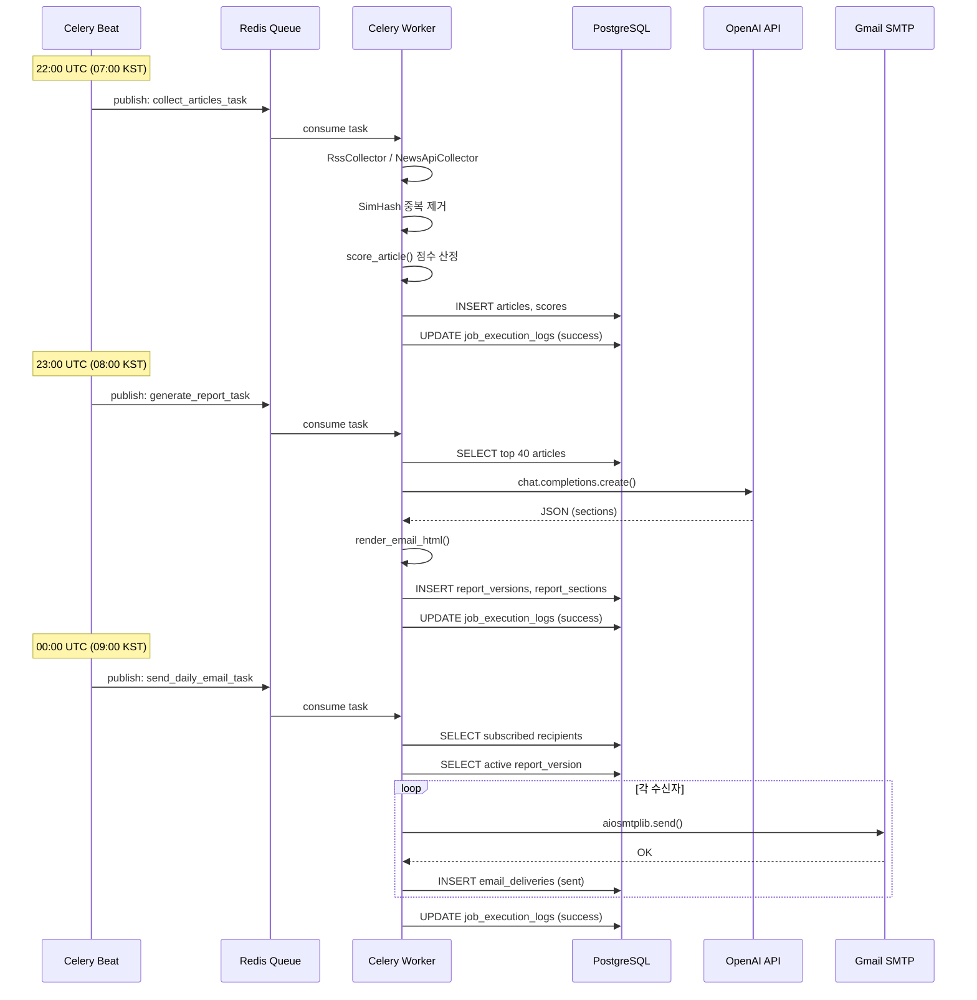

---

## 5. 기사 수집 알고리즘

```mermaid
flowchart TD
    subgraph RSS["RssCollector"]
        R1[feedparser.parse(feed_url)] --> R2[각 entry 순회]
        R2 --> R3[제목 / URL / 날짜 추출]
        R3 --> R4[_normalize_url()<br/>UTM 파라미터 제거]
        R4 --> R5[_clean_html()<br/>HTML 태그 제거]
        R5 --> R6[RawArticle 반환]
    end

    subgraph API["NewsApiCollector"]
        A1[httpx.get(newsapi.org/v2/everything)] --> A2[파라미터: q, language, pageSize]
        A2 --> A3[articles[] 순회]
        A3 --> A4[publishedAt ISO 파싱]
        A4 --> A5[RawArticle 반환]
    end

    subgraph Save["CollectorService.run_collection()"]
        S1[활성 소스 목록 조회] --> S2[소스별 Collector 선택]
        S2 --> S3[collector.collect()]
        S3 --> S4{canonical_url<br/>이미 DB에 존재?}
        S4 -->|YES| S5[스킵]
        S4 -->|NO| S6[deduplicator 호출]
        S6 --> S7[scorer.score_article() 호출]
        S7 --> S8[DB 저장<br/>articles + contents + fingerprints + scores]
        S8 --> S9[source.last_collected_at 업데이트]
    end

    RSS --> Save
    API --> Save
```

**URL 정규화 규칙** (`_normalize_url`):
- `utm_source`, `utm_medium`, `utm_campaign`, `utm_content`, `utm_term` 파라미터 제거
- `#` 앵커(fragment) 제거
- 소문자로 통일 후 trailing slash 제거

---

## 6. 중복 제거 알고리즘 (SimHash)

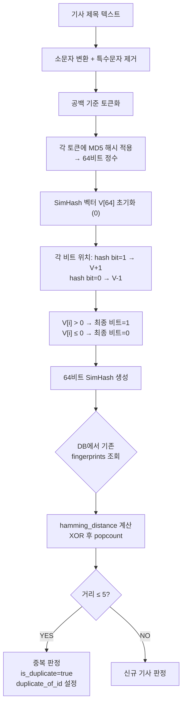

**임계값 설명:**
- 해밍거리 0: 완전 동일한 제목
- 해밍거리 1–5: 단어 1–3개 차이 (동일 기사의 변형 제목으로 판단)
- 해밍거리 6+: 다른 기사로 판단

---

## 7. 기사 점수 산정 알고리즘

```mermaid
flowchart TD
    A[RawArticle<br/>title + content] --> B[_keyword_score()]
    A --> C[_novelty_indicators()]
    A --> D[_dev_relevance()]

    B --> B1["HIGH_IMPORTANCE_KEYWORDS 매칭<br/>예: GPT, Claude, Gemini, API, LLM"]
    B1 --> B2[importance_score<br/>0.0 ~ 1.0]

    C --> C1["신규성 지표 단어 매칭<br/>예: launch, release, first, announce"]
    C1 --> C2[novelty_score<br/>0.0 ~ 1.0]

    D --> D1["개발자 신호 매칭<br/>예: API, SDK, GitHub, Docker, benchmark"]
    D1 --> D2[developer_relevance_score<br/>0.0 ~ 1.0]

    B2 --> E["composite_score<br/>= importance × 0.4<br/>+ novelty × 0.2<br/>+ dev_relevance × 0.4"]
    C2 --> E
    D2 --> E

    E --> F[_guess_category()<br/>카테고리 자동 분류]
    F --> F1["model_llm / ai_agent / infra_serving<br/>opensource_framework / product_launch<br/>research_paper / security_policy<br/>dev_tools / other"]
    F1 --> G[ArticleScore DB 저장]
```

**점수 가중치 설계 의도:**
- `importance (40%)`: 얼마나 중요한 AI 기술인지
- `novelty (20%)`: 새로운 발표/출시인지
- `dev_relevance (40%)`: 실제 개발자 업무에 관련이 있는지

---

## 8. 리포트 생성 파이프라인 (LLM)

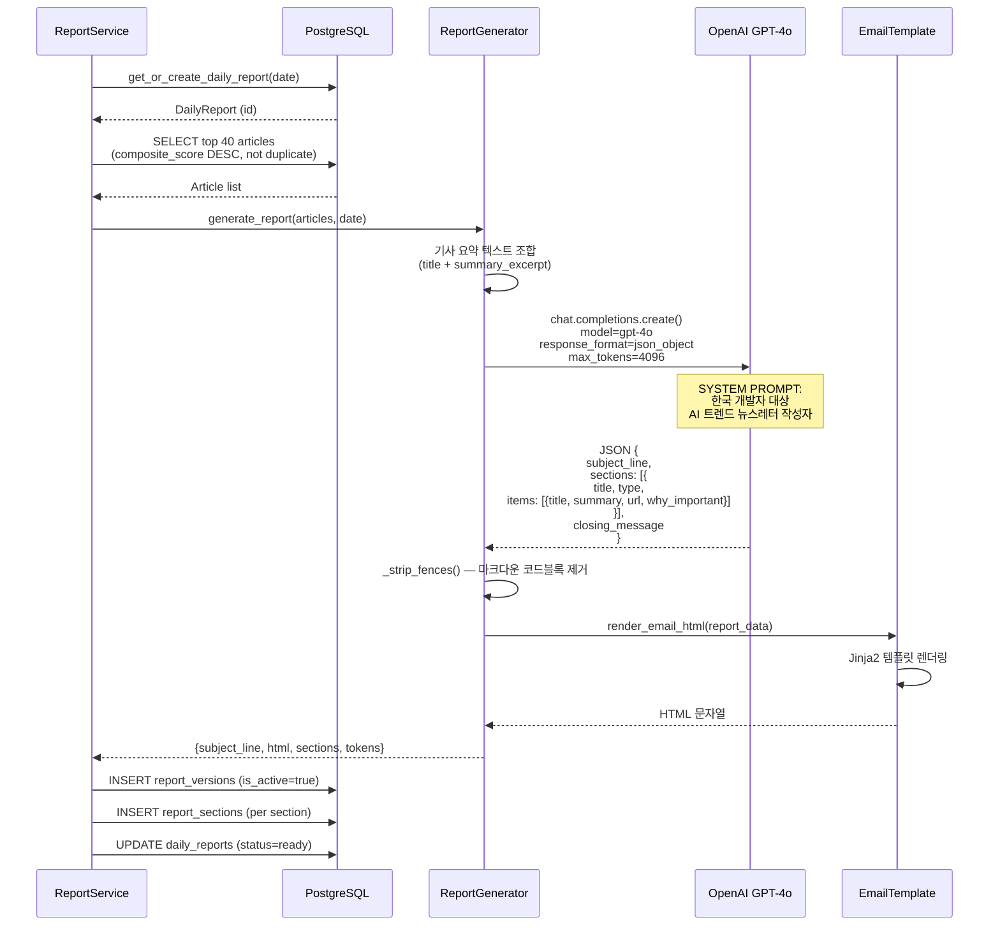

**GPT 응답 JSON 구조:**
```json
{
  "subject_line": "이메일 제목",
  "sections": [
    {
      "title": "섹션 제목",
      "type": "top_issues | tech_changes | new_services",
      "items": [
        {
          "title": "기사 제목",
          "summary": "한국어 요약",
          "url": "원문 URL",
          "why_important": "개발자에게 중요한 이유"
        }
      ]
    }
  ],
  "closing_message": "마무리 메시지"
}
```

---

## 9. 이메일 발송 파이프라인

```mermaid
flowchart TD
    A[send_email_task 호출<br/>report_id] --> B[DB: 활성 report_version 조회]
    B --> C{is_active=true<br/>버전 존재?}
    C -->|NO| D[ValueError 발생<br/>작업 실패 기록]
    C -->|YES| E[DB: subscribed=true<br/>수신자 목록 조회]

    E --> F[aiosmtplib.SMTP 연결<br/>SMTP_HOST:SMTP_PORT]
    F --> G[STARTTLS 또는 SSL 협상]
    G --> H[SMTP_USER/PASSWORD 인증]

    H --> I[수신자 리스트 순회]
    I --> J["EmailMessage 구성<br/>From: SMTP_FROM_EMAIL<br/>To: recipient.email<br/>Subject: subject_line<br/>Content-Type: text/html"]
    J --> K[_send_single() 호출]
    K --> L{발송 성공?}
    L -->|YES| M[DB: email_deliveries<br/>status=sent, sent_at=now]
    L -->|NO| N[DB: email_deliveries<br/>status=failed, error_message]
    M --> I
    N --> I

    I -->|완료| O[결과 집계<br/>sent_count / failed_count]
    O --> P[DB: job_execution_logs 업데이트]
```

---

## 10. 데이터베이스 스키마 (ERD)

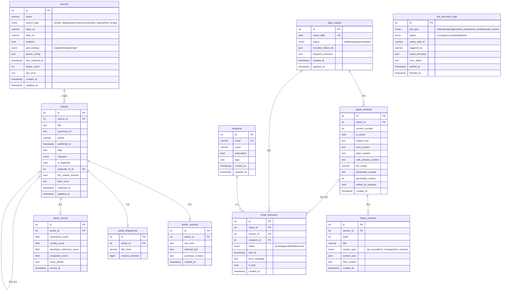

---

## 11. API 엔드포인트 구조

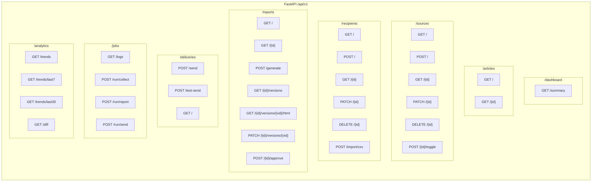

---

## 12. Frontend 페이지 구조

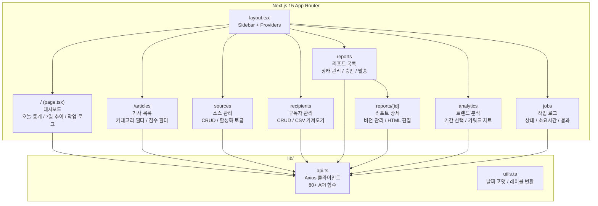

---

## 13. Celery 태스크 상태 전환

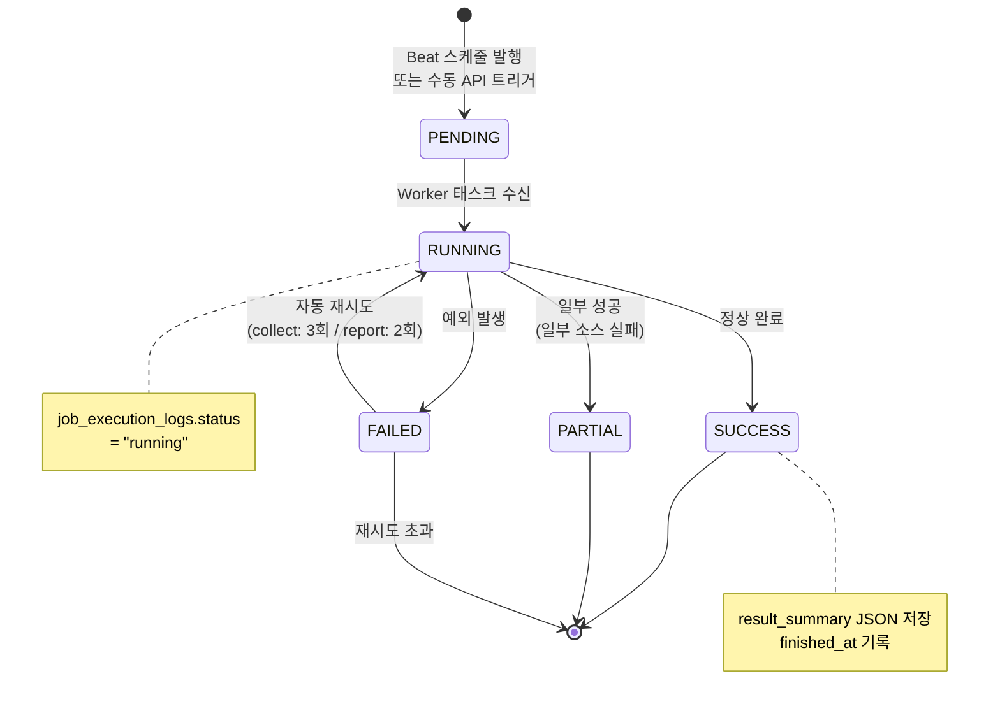

---

## 14. 디렉토리 구조

```
AI-Trend-tracker-mk-1-claude/
├── backend/
│   ├── alembic/                    # DB 마이그레이션
│   │   ├── env.py                  # Alembic 환경 설정
│   │   └── versions/
│   │       └── 001_initial_schema.py  # 초기 스키마 (11개 테이블)
│   ├── app/
│   │   ├── analyzers/
│   │   │   ├── deduplicator.py     # SimHash 중복 제거 (MD5 + 해밍거리)
│   │   │   └── scorer.py           # 기사 점수 산정 (importance/novelty/dev)
│   │   ├── api/v1/
│   │   │   ├── analytics.py        # 트렌드 분석 엔드포인트
│   │   │   ├── articles.py         # 기사 조회 엔드포인트
│   │   │   ├── dashboard.py        # 대시보드 요약 엔드포인트
│   │   │   ├── deliveries.py       # 이메일 발송 엔드포인트
│   │   │   ├── jobs.py             # 작업 로그 / 수동 트리거 엔드포인트
│   │   │   ├── recipients.py       # 구독자 관리 엔드포인트
│   │   │   ├── reports.py          # 리포트 관리 엔드포인트
│   │   │   └── sources.py          # 소스 관리 엔드포인트
│   │   ├── collectors/
│   │   │   ├── base.py             # BaseCollector 추상 클래스
│   │   │   ├── rss_collector.py    # RSS/Atom 피드 수집기
│   │   │   └── api_collector.py    # NewsAPI 수집기
│   │   ├── generators/
│   │   │   ├── report_generator.py # GPT-4o LLM 리포트 생성
│   │   │   └── email_template.py   # Jinja2 HTML 이메일 템플릿
│   │   ├── models/
│   │   │   ├── source.py           # Source, SourceType, PollStrategy
│   │   │   ├── article.py          # Article, ArticleContent, Score, Fingerprint
│   │   │   ├── report.py           # DailyReport, ReportVersion, Section, Delivery
│   │   │   ├── recipient.py        # Recipient
│   │   │   └── job.py              # JobExecutionLog
│   │   ├── services/
│   │   │   ├── collector_service.py  # 수집 오케스트레이션
│   │   │   ├── report_service.py     # 리포트 생성 오케스트레이션
│   │   │   ├── email_service.py      # 이메일 발송 (aiosmtplib)
│   │   │   └── analytics_service.py  # 트렌드 분석 집계
│   │   ├── workers/
│   │   │   ├── celery_app.py       # Celery 앱 + Beat 스케줄 정의
│   │   │   └── tasks.py            # 태스크 함수 (LoggedTask 기반)
│   │   ├── config.py               # Pydantic Settings (환경변수)
│   │   ├── database.py             # AsyncEngine + Session
│   │   └── main.py                 # FastAPI 앱 진입점
│   ├── scripts/
│   │   └── seed_sources.py         # 기본 12개 뉴스 소스 시드
│   ├── Dockerfile
│   └── pyproject.toml              # 의존성 정의 (setuptools.build_meta)
├── frontend/
│   ├── src/
│   │   ├── app/                    # Next.js App Router 페이지
│   │   ├── components/layout/      # Sidebar 컴포넌트
│   │   └── lib/
│   │       ├── api.ts              # Axios API 클라이언트 (80+ 함수)
│   │       └── utils.ts            # 유틸리티 함수
│   ├── Dockerfile
│   ├── next.config.js
│   ├── tailwind.config.js
│   └── package.json
├── scripts/
│   └── init_db.sh                  # DB 초기화 스크립트
├── docker-compose.yml
├── .env.example                    # 환경변수 템플릿
├── .gitignore
├── ARCHITECTURE.md                 # 본 문서
├── DEPENDENCIES.md
├── MANAGEMENT.md
└── README.md
```
